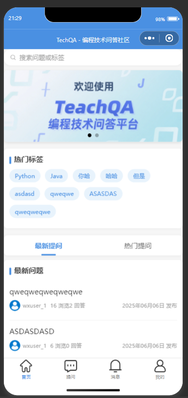
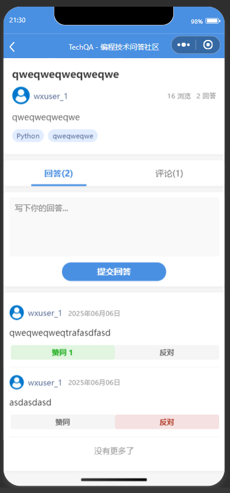
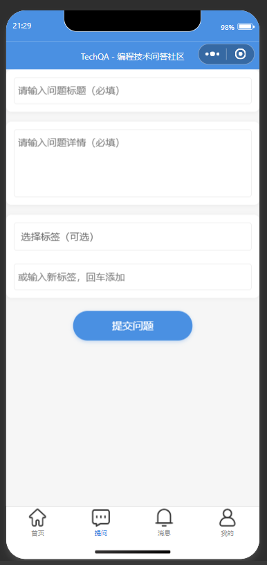
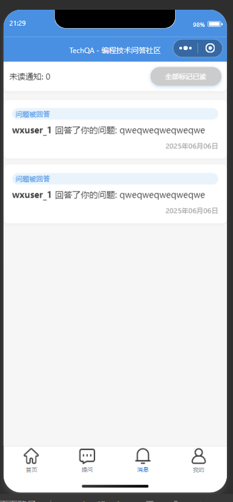
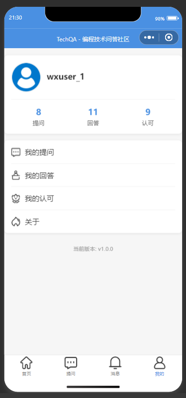

# TechQA - 编程技术问答社区

[](./LICENSE)
[](https://python.org)
[](https://www.djangoproject.com/)
[](https://www.django-rest-framework.org/)

一个类似Stack Overflow的编程技术问答平台后端，使用Django Rest Framework (DRF)实现，并支持微信小程序对接。

## ✨ 功能特性

- ✅ 用户系统（微信登录）
- ✅ 问题管理（前台提问、后台管理）
- ✅ 回答管理（前台回答、后台管理）
- ✅ 评论支持（对问题的评论）
- ✅ 投票支持（赞同/反对）
- ✅ 标签分类
- 🔍 搜索支持
- 🔔 通知支持
- 📱 微信小程序支持

## 🛠 技术栈

### 后端

-  Django 4.x
-  Django Rest Framework
-  SimpleJWT (认证)
-  SQLite (开发)

### 前端(小程序)

-  微信小程序

## 🚀 快速开始

### 前提条件

- Python 3.8+
- pip
- SQLite

```bash
# 安装依赖
pip install django djangorestframework django-filter djangorestframework-simplejwt pillow python-dotenv
```

```bash
# 克隆仓库

# gitee
git clone git@gitee.com:charlie-zhang-code/techqa.git

# github
git clone git@github.com:charlie-zhang-code/techqa.git
```

访问 http://localhost:8000/admin 进入管理后台

## 📂 项目结构

```
techqa/
├── qa/                    # 主应用
│   ├── migrations/        # 数据库迁移文件
│   ├── models/            # 数据模型
│   ├── serializers/       # DRF序列化器
│   ├── services/          # 业务逻辑
│   ├── signals/           # 信号处理
│   ├── tasks/             # 异步任务
│   ├── tests/             # 测试用例
│   ├── utils/             # 工具类
│   ├── views/             # 视图层
│   └── ...
├── techqa/                # 项目配置
├── docs/                  # 文档和截图
├── .github/               # GitHub配置
├── .env.example           # 环境变量示例
├── wxpage                 # 微信小程序
└── README.md              # 项目说明
```

## 📸 截图

| 功能页面 | 截图                        |
|------|---------------------------|
| 首页   |      |
| 问题详情 |  |
| 提问页面 |  |
| 消息页面 |  |
| 个人中心 |  |

## 📜 许可证

本项目采用 [MIT 许可证](./LICENSE)